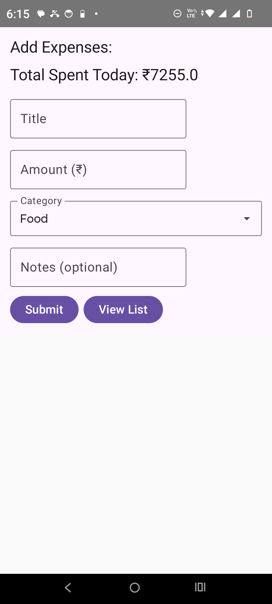
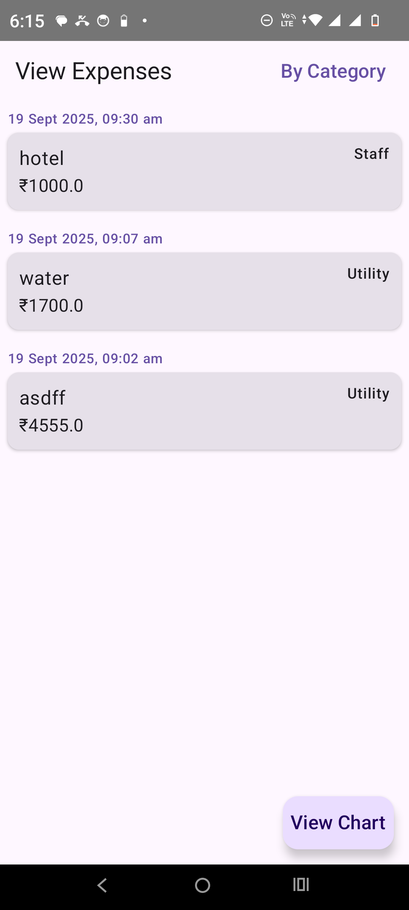
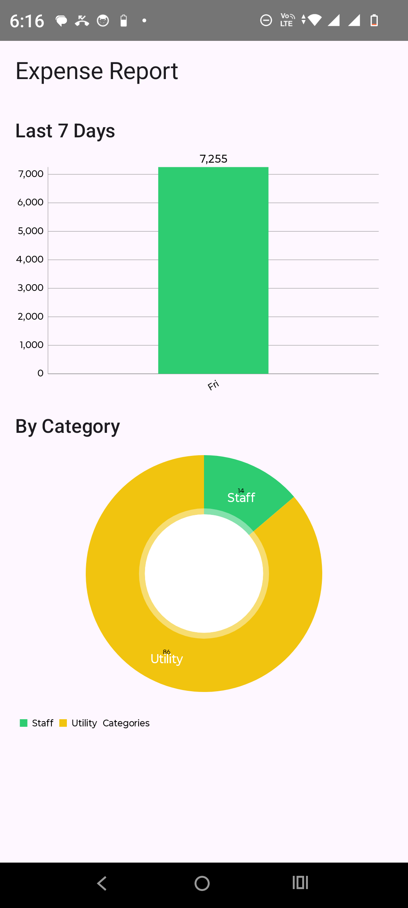

# 📊 Smart Expense Tracker

A modern **Expense Tracking App** built with **Jetpack Compose**, **Clean MVVM Architecture**, and **Material 3**, designed to showcase clean code practices, modular architecture, and state-of-the-art Android libraries.

---

## 🚀 Features

- ✨ Add, view, and categorize expenses
- 📅 Group expenses **by date & time** or **by category**
- 📊 Interactive charts using **MPAndroidChart**
- 💾 Offline storage with **Room Database**
- 🧩 Multi-module **Clean Architecture** (data, domain, ui)
- 🔄 Reactive state management with **StateFlow**
- 🎨 Beautiful UI with **Material 3** and dynamic theming
- 📱 Built fully in **Jetpack Compose**

---

## 🏗️ Architecture

This project follows **Clean MVVM Architecture** with **UseCases**:


- **UI Layer**: Jetpack Compose screens (Stateless UIs)
- **ViewModel Layer**: Exposes immutable state via `StateFlow`
- **Domain Layer**: Business logic with UseCases (`AddExpenseUseCase`, `GetExpensesByDateUseCase`, `GetReportUseCase`)
- **Data Layer**: Room DB, Repositories

---

## 🛠️ Tech Stack

- **Language**: Kotlin
- **UI**: Jetpack Compose, Material 3
- **Navigation**: Navigation-Compose
- **Dependency Injection**: Hilt
- **Database**: Room
- **Charting**: MPAndroidChart
- **Async**: Kotlin Coroutines, Flow/StateFlow

---

## 📸 Screenshots

_Add screenshots here once the app runs_
| Expense List | Add Expense | Expense Report |
|--------------|-------------|----------------|
|  |  |  |

---

## ⚙️ Setup & Installation

1. Clone the repository:
   ```bash
   git clone https://github.com/your-username/smart-expense-tracker.git
   cd smart-expense-tracker

 ## 🤖 AI Usage Summary  
 This Expense Tracker app was developed with assistance from AI (ChatGPT) to speed up design and implementation. AI support was used for:

 1. Generating initial scaffolding with Clean MVVM architecture, Hilt DI, and Room database setup.

 2.Implementing Jetpack Compose UI screens, navigation graph, and reusable components.

 3. Adding and refactoring charting features (Vico → MPAndroidChart) to remove dummy values.

4. Improving UX features such as keyboard hiding, dropdown alignment, and back navigation.

5.Creating documentation (README, comments, usage summary).

All generated content was reviewed, refined, and tested manually before being integrated into the final project.

## 📑 Prompt Logs (Key Prompts + Retries)
Below is a high-level summary of the key AI interactions during development:

1. Architecture Setup

Prompt: “Create a multi-screen Expense Tracker app using Jetpack Compose, Clean MVVM architecture with usecase model.”

Retries: Added KSP/Hilt support, resolved dependency issues.

2. ViewModel & UI Wiring
   
Prompt: “Create ExpenseReportViewModel from existing data model class Expense & ExpenseRepository model and update ExpenseReportScreen.”

Retries: Fixed unresolved references (Flow<Pair<>>, list.filter, Pair).

3. Charts
   
Prompt: “Add clean charts (MPAndroidChart / Compose-Chart implementation).”

Retries: Replaced Vico with AndroidView + MPAndroidChart, also fixed issue related dummy values.

4.UI Enhancements

Prompt: “Align category dropdown dynamically in ExpenseEntryScreen.”

Retries: Added ExposedDropdownMenuBox, resolved selectedCategory binding.

5. Documentation & Readiness
   
Prompt: “Create README page for GitHub.”

Prompt: “Comment the code in Expense Tracker app.”

Result: Fully documented project skeleton + portfolio-ready README.

